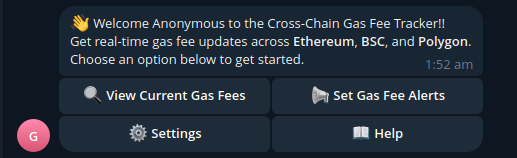

# ⛽ Cross-Chain Gas Fee Tracker Bot

A Telegram bot that monitors real-time gas fees across multiple blockchains (Ethereum, BSC, Polygon, etc.) and sends alerts when fees drop below user-defined thresholds.



## ✨ Features

- **Multi-Chain Support**: Track gas fees on Ethereum, BSC, Polygon, and more
- **Smart Alerts**: Get notified when fees drop below your custom threshold
- **Real-Time Data**: Fetches live gas prices from blockchain explorers
- **User-Friendly**: Simple commands with intuitive responses
- **Scheduled Checks**: Automatic background monitoring every 5 minutes

## 🛠️ Tech Stack

- **Core**: Python 3.10+
- **Telegram Bot**: `python-telegram-bot` library
- **APIs**: Etherscan, BscScan, PolygonScan
- **Scheduler**: APScheduler
- **Database**: SQLite (or Firebase for cloud version)
- **Deployment**: Docker + AWS EC2/VPS

## 🚀 Getting Started

### Prerequisites
- Python 3.10+
- Telegram Bot Token ([Get from @BotFather](https://t.me/BotFather))
- Free API keys from:
  - [Etherscan](https://etherscan.io/apis)
  - [BscScan](https://bscscan.com/apis)
  - [PolygonScan](https://polygonscan.com/apis)

### Installation
1. Clone the repo:
   ```bash
   git clone https://github.com/yourusername/gas-fee-bot.git
   cd gas-fee-bot
   ```

2. Install dependencies:
   ```bash
   pip install -r requirements.txt
   ```

3. Configure environment:
   ```bash
   cp .env.example .env
   # Edit .env with your API keys and bot token
   ```

4. Run the bot:
   ```bash
   python main.py
   ```

## 🤖 Bot Commands

| Command                    | Description             | Example               |
| -------------------------- | ----------------------- | --------------------- |
| `/start`                   | Show welcome message    | `/start`              |
| `/setalert <chain> <gwei>` | Set price alert         | `/setalert polygon 5` |
| `/myalerts`                | View your active alerts | `/myalerts`           |


## 🏗️ Project Structure

```
gas-fee-bot/
├── core/               # Main logic
│   ├── gas_tracker.py  # API interactions
│   ├── alert_manager.py # Alert processing
│   └── scheduler.py    # Background checks
├── bot/                # Telegram handlers
│   ├── commands.py     # Command logic
│   └── bot_init.py     # Bot setup
├── data/               # Database files
├── config/             # API keys and constants
├── .env                # Environment variables
└── main.py             # Entry point
```

## 🌐 Deployment

### Option 1: VPS (Recommended)
```bash
# Run persistently using tmux/screen
tmux new -s gasbot
python main.py
# Ctrl+B then D to detach
```

### Option 2: Docker
```bash
docker build -t gas-bot .
docker run -d --restart always --name gas-bot gas-bot
```

## 📈 Roadmap

- [ ] Add Solana and Avalanche support
- [ ] Implement gas fee predictions (AI)
- [ ] Create web dashboard for analytics
- [ ] Multi-language support

## 🤝 Contributing

1. Fork the project
2. Create your feature branch (`git checkout -b feature/AmazingFeature`)
3. Commit your changes (`git commit -m 'Add some amazing feature'`)
4. Push to the branch (`git push origin feature/AmazingFeature`)
5. Open a Pull Request

## 📜 License

Distributed under the MIT License. See `LICENSE` for more information.

Would you like me to add any specific details about your implementation?